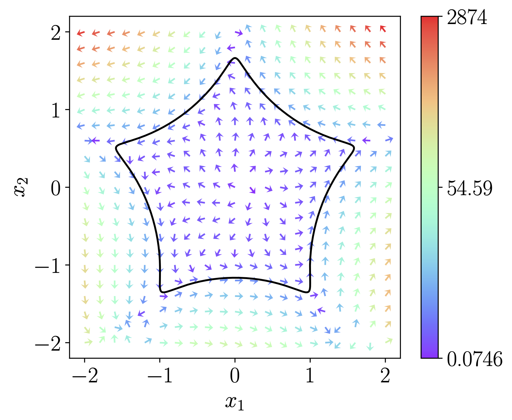

# <b> Designing two-dimensional limit-cycle oscillators with prescribed trajectories and phase-response characteristics </b>

## <b> \<Description\> </b>

The code is for designing the vector field of two-dimensional limit-cycle oscillators with prescribed trajectories and phase-response characteristics, which is described in the paper: 
<!-- <a href="XXX" target="_blank">　-->
<!-- N. Namura, T. Ishii, and H. Nakao, -->
"Designing two-dimensional limit-cycle oscillators with prescribed trajectories and phase-response characteristics,"
<!--　</a> -->
accepted by <b><i> XXX. </i></b>

If you use this code, please cite: 
<b><i> XXXXXXXXXX. </i></b>

<!--
The code is for designing the vector field of two-dimensional limit-cycle oscillators with prescribed trajectories and phase-response characteristics.
-->

## <b> \<Usage\> </b>
### <b> For designing oscillators, please run </b>
- main_existing.m: For existing oscillators. 
- main_artificial.m: For artificial oscillators and entrainment.

For visualizing vector fields, please run
- vector_field.py 

You will get the figure like this:

    

### <b> Files: </b>
- funcs.m: Functions
- utils.m: Utilities (mainly for showing figures)
- designed.m: Class for designed oscillator
- floquet.m: Calculation of PSF and Floquet exponent
- stuart_landau.m: Stuart-Landau (SL) oscillator
- van_der_pol.m: van der Pol (vdP) oscillator
- fitzhugh_nagumo.m: FitzHugh-Nagumo (FHN) oscillator
- CIMA.m: Chlorite-iodide-malonic acid (CIMA) oscillator
- sync_cluster.m: Oscillator with unit circle trajectory and high-harmonic PSF
- star.m: Star-shaped oscillator
- mystyle.m: Setting

## <b> \<Environments\> </b>
### MATLAB R2022a
- Optimization Toolbox
- Statistics and Machine Learning Toolbox

### Python 3.9.6
- requirements.txt is attached

## <b> \<Contact\> </b>
E-mail: namura.n.aa@m.titech.ac.jp